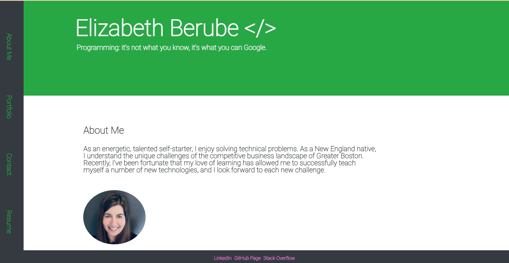

# portfolio-page

## Description
This updated portfolio page has been updated with more features, better styling, and up-to-date projects.
 
Here are some of the features of this page:
 
1. This page has a contact me section that alerts users if there are any errors.
 
2. Includes links to GitHub profile, Stack Overflow Profile and LinkedIn profile.
 
3. Has a resume section where users can download a copy of my resume.
 
4. It has projects with the titles, links to deployed versions, Links to GitHub repositories, and pictures.
 
5. The design is mobile-responsive.
 
6. React was used to build this application.

---

## Table of content

* [Description](#description)

* [Usage](#usage)

* [Links](#links)

* [Questions](#questions)

* [Pictures](#pictures)

---

## Usage

Updated portfolio page.

## Questions

If you have any questions  then you can contact me directly at 

elizabethdberube@gmail.com

## Links

Link to page:  https://elizabethdberube.github.io/portfolio-page/

## Pictures

